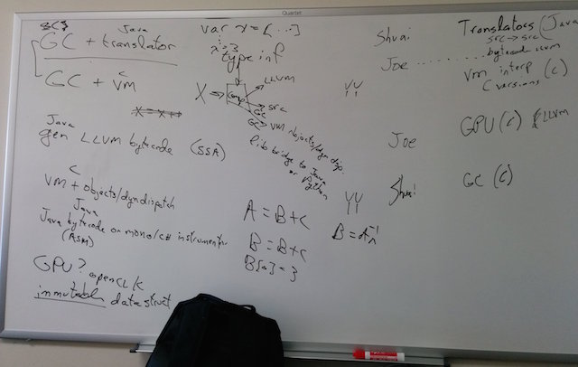

# Terence's original mail to Olga (as a memo):

We are planning to design/build a computer language with multiple implementations: generating LLVM, translating to C, generating our own bytecode. Then we’ll implement the VM for the bytecode with a sophisticated garbage collector. The language will be likely pure functional and include immutable data structure implementations as part of its library.

We can add some parallel operator implementation for vectors/matrices too.

Brainstorming:


	
# Initial thoughts of the language

1. Statically typed, although not necessarily explicitly typed.
2. Translated to other language source (like C) or LLVM IR.
3. Could be run on a virtual machine (thus has its own bytecode).
4. Source-to-source translation and interpreter version support garbage collection. (GC for LLVM-based version is to be determined.)
5. Has pure-functional traits, like built-in immutable data structures and vector operations (that run on GPUs).
6. Support for bridge to other languages like (JAVA, Python).

# Syntax and semantics

Symbols are identifiers `[a-zA-Z_][a-zA-Z_0-9]*` arithmetic operators, parentheses, and other syntactic stuff.

A file is a script with statements and function definition at the outermost level.

Whitespace not significant except as separator between symbols. Newline and semicolon are not used to separate statements. I.e., the following is ok:

```javascript
x = 1 x = x + 1
```

and means same thing as

```javascript
x = 1
x = x + 1
```

ANTLR parsers can handle this as it's not ambiguous.

Comments are `//` and `/*...*/` like Java/C++.

## Expressions

The basics; ints, floats, strings

```javascript
var x = 1	       // type inference of int
var y = x*2.34   // type inference of float
print(abs(y))
var z = "hi"     // strings are immutable
```

Vectors of floats, indexed from 1 not 0.

```javascript
var X = [1, 2.3, 99.0024] // vectors are always floats
print(X*3)       // overload operators for vec-scalar, vec-vec
print(X+X)
print(X . X)     // dot product; period with spaces around it
sin(3.14)
sin(X)           // like R and numpy, apply sin() to all X
```

### Operators

`+`, `-`, `*`, `/`, `^`, `.`, `:` (slice operator for vectors)

## Statements

```javascript
if (<expr>) <stat>
if (<expr>) <stat> else <stat>
```

```javascript
while ( <expr> ) <stat>
```

```javascript
{ <statement>+ '}'
```

```javascript
var id = <expr>
```

```javascript
return <expr>
```

```javascript
x = <expr>
X[<expr>] = <expr>
```

### Assignment semantics

```javascript
x = <scalar-expr>         # copy scalar-expr to x
x = <vector-expr>         # copy vector-expr to x (avoids aliasing)
```

```javascript
s[i] = <expr>             # static compilation error if s is string
v[i] = <scalar-expr>      # alter v if v local to function
v[i] = <scalar-expr>      # set v to new copy, alter v if v arg or global
```

## Functions

### Syntax

```javascript
func dub(x : int) : int { return x*2 }
```

### Side-effect free

* Semantics are pass-by-value to/from functions. E.g., no way to swap two arguments like swap(x,y).
* Function calls have no side-effects; i.e., they cannot alter parameters or globals.
* However, a function *can* alter any data that is visible/accessible only to that function.
* Implicit move semantic for rvalue. E.g., literal as arguments or function return values could be moved.

The implementation can use pass-by-reference and then copy-on-write for data altered within a function for efficiecy (avoid copying data each time to/from a function). Example:

```javascript
X = [1,2,3]
func f(X : []) {  // [] is both "empty vector" and typename
    X = 2*X       // X points to new copy of X with 2*X in it
    g(X)
}

func g(X : []) {
    print(X[1])   // prints "2"
}

f(X)
print(X[1])       // prints "1"
```

```javascript
func f(X : []) {  // [] is both "empty vector" and typename
    var Y = X     // Y is a copy of X
    X[1] = 99     // impl: X points to new copy of X with X[0] changed
    X[2] = 100    // X is same copy made in previous statement
    print(X[1])   // prints "99"
    print(X[2])   // prints "100"
    print(Y[1])   // prints "1" not "99"
}

f(X)
print(X[1])       // prints "1" not "99"
```

```javascript
func f(X : []) {  // impl: pass X as pointer to vector
    X[1] = 0      // impl: copy X and set X to new copy
    return X
}

var Y = f([1,2]) // [1,2] first moved into X, [0,2] moved into Y.
```

Disallow nested functions.

### Copy-on-write semantics

Implementation of pass-by-value would use pass-by-reference with copy-on-write. I.e., detect when we are altering a vector aliased and hence visible to another function.  `x[i]=v` for vectors would translate to:

```c
if ( x->refs > 1 ) { x->refs--; x = <copy of x>; }
x[i-1] = v;
```

Assignments must bump ref count; `x = y` for strings or vectors:

```c
x = y;
x->refs++; // x and y point to same thing
```

Same for function call args; `f(x)` for x string or vector:

```c
x->refs++;
f(x);
```

Putting together, `y=f(x)` becomes:

```c
x->refs++;
y = f(x);
y->refs++;
```

When variables go out of scope, we drop the ref count. 

```javascript
func f(x : []) {
	var y = x
	...
}
```

becomes:

```c
void f(vector *x) {
	vector *y = x;
	y->ref++;
	...
	y->refs--;
	x->refs--;
}
```

int and float scalars are mapped directly to C. `x = y` for scalars is same in wich and C.

## Scoping

* Global variables
* Functions, arguments
* Local variables, possibly with nested {...} scopes

Functions can reference but not alter or set globals.

```javascript
var MAX = 100
var salaries = [1,2,3]
func f(x : int) {
	x = MAX			// no problem
	MAX = 3			// static compiler error
	salaries[1] = 99 // static compiler error
}
```

# Tasks

## Reference counting

* grammar
* translate sample program to C manually and then identify parse tree -> output translation pieces
* symbol table construction
* type annotations on parse tree, includes type propogation (inference)
* type checker that compares types of left and right side of assignment
* translation to C
* a bit of runtime C code (string library, init vector, vector operations)

```c
typedef struct {
	int len;			// number of floats
	int refs;			// refs to this vector
	float data[];		// a label to the start of the data part of vector
} vector;
```

## Mark-and-sweep

## Generational GC
